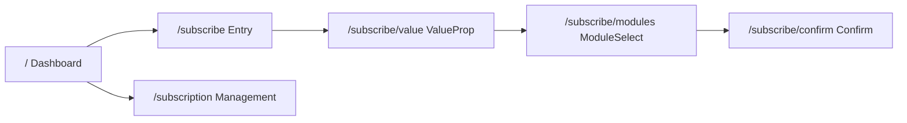

# 2GIS Subscription Web App

## 📖 Содержание

1. [Технологии](#технологии)
2. [Структура проекта](#структура-проекта)
3. [Маршруты и компоненты](#маршруты-и-компоненты)
4. [Пользовательские сценарии](#пользовательские-сценарии)
5. [Разработка](#разработка)
6. [API и моки](#api-и-моки)

---

## 🚀 Технологии

### Frontend Stack
- **React 17+** + **TypeScript**
- **Vite** (сборка + dev-сервер)
- **React Router 6** (маршрутизация)
- **Tailwind CSS** + **shadcn/ui** (Card, Button, Tabs, Accordion)
- **Context API** (стейт для подписки и выбранных модулей)

### Внешние сервисы
- **2GIS Web SDK** (компонент `<MapWrapper/>`)
- **msw** (Mock Service Worker для `/api/subscription` и `/api/map`)
- **Y Pay** (iframe для платежей)

---

## 📂 Структура проекта

```
/src
 ├─ App.tsx                    # BrowserRouter + Layout с Header и FooterNav
 ├─ routes.tsx                 # все Route-объявления + ленивый импорт
 ├─ layouts/
 │   └─ SubscribeLayout.tsx    # шапка + TabBar для "Выгода"/"Модули" + Outlet
 ├─ pages/
 │   ├─ Dashboard.tsx          # Главная страница с картой
 │   ├─ SubscribeEntry.tsx     # Вход в подписку (табы "Выгода"/"Модули")
 │   ├─ ValueProp.tsx          # Экран ценности подписки
 │   ├─ ModuleSelect.tsx       # Выбор модулей подписки
 │   ├─ Confirm.tsx            # Подтверждение и оплата
 │   └─ SubscriptionMgmt.tsx   # Управление подпиской
 ├─ components/
 │   ├─ Header.tsx             # Шапка с бургер-меню, логотипом, профилем
 │   ├─ FooterNav.tsx          # Футер-навигация (опционально для десктопа)
 │   ├─ Card.tsx               # Карточки модулей
 │   ├─ Tabs.tsx               # Обёртка над shadcn/ui/Tabs
 │   ├─ Accordion.tsx          # F.A.Q секция
 │   └─ MapWrapper.tsx         # Инициализация 2GIS SDK + слой кешбэка/купонов
 ├─ context/
 │   └─ SubscriptionContext.tsx # Глобальный стейт подписки
 ├─ api/
 │   └─ mocks.ts               # MSW handlers для API
 └─ styles/
     └─ tailwind.css           # Стили Tailwind
```

---

## 🗺️ Маршруты и компоненты

### Диаграмма маршрутов


### Детальное описание страниц

| Путь | Компонент | Описание |
|------|-----------|----------|
| `/` | `<Dashboard />` | **Главная страница**<br/>• Хедер: ☰, логотип 2GIS, аватар<br/>• Карта в фоне<br/>• Overlay-кард "Попробовать подписку" с кнопкой |
| `/subscribe` | `<SubscribeEntry />` | **Вход в подписку**<br/>• Статичный экран с двумя табами:<br/>  - "Выгода" (фокус на кешбэк, купоны)<br/>  - "Модули" (превью карточек)<br/>• CTA "Оформить" открывает `<ValueProp />` |
| `/subscribe/value` | `<ValueProp />` | **Ценность подписки**<br/>• Большой заголовок и список ценностей<br/>• Стикер-таббар внизу (Tailwind Tabs) для переключения между "Выгода" и "Модули"<br/>• Кнопка "Далее" |
| `/subscribe/modules` | `<ModuleSelect />` | **Выбор модулей**<br/>• Сеточный список карточек модулей (Navigation Pro, Social +, Offline +)<br/>• Тогглы или чекбоксы внутри карточек<br/>• Кнопка "Далее" |
| `/subscribe/confirm` | `<Confirm />` | **Подтверждение заказа**<br/>• Итоговый скрин с суммой и списком выбранных модулей<br/>• CTA "Подтвердить"<br/>• При клике: открывается оверлей с iFrame Y Pay (анимация "Please wait") |
| `/subscription` | `<SubscriptionMgmt />` | **Управление подпиской**<br/>• Страница "Моя подписка": статус ("Активна"), дата списания, баланс баллов<br/>• Кнопка "Заморозить"<br/>• Секция "Опции" с тогглами для подключённых модулей (Toggle UI) |

### Общие элементы всех экранов
- **Хедер**: бургер-меню, логотип, профиль
- **Для `/subscribe*`**: sticky TabBar под шапкой
- **F.A.Q**: внизу экранов `<Accordion />` из shadcn/ui

---

## 👤 Пользовательские сценарии

### A. Запуск подписки
1. Пользователь попадает на `/` → видит карту и карточку-приманку "Попробовать подписку"
2. Клик → переходит на `/subscribe` (Entry)
3. Сначала открыт таб "Выгода": пользователь читает про кешбэк, купоны, офлайн-ценность
4. Переключается на таб "Модули" — знакомится с модулями
5. Нажимает "Оформить" → переходит в `/subscribe/value`
6. Последовательно проходит шаги `/subscribe/value` → `/subscribe/modules` → `/subscribe/confirm`
7. На шаге Confirm кликает "Подтвердить" → появляется оверлей с ифреймом Y Pay и индикатором "Please wait"
8. После успешной оплаты редирект на `/subscription`

### B. Управление подпиской
1. `/subscription`: показывает статус, дату списания, баланс баллов
2. Юзер может:
   - Заморозить подписку (кнопка верхнего уровня)
   - Подключать/отключать модули в списке опций (Toggle внутри карточек)
   - Смотреть историю транзакций (кнопка "История")

### C. F.A.Q
- Внизу `/subscribe*` экранов добавляем аккордеон с часто задаваемыми вопросами

---

## 🛠️ Разработка

### Установка и запуск
```bash
# Установка зависимостей
npm install

# Запуск dev-сервера
npm run dev

# Сборка для продакшена
npm run build

# Предварительный просмотр сборки
npm run preview
```

### Ключевые компоненты для разработки

#### Context API
- `SubscriptionContext.tsx` - глобальный стейт для:
  - Выбранных модулей
  - Статуса подписки
  - Пользовательских данных

#### Основные хуки
- `useSubscription()` - работа с контекстом подписки
- `useModules()` - управление модулями
- `usePayment()` - обработка платежей

#### Важные компоненты
- `<MapWrapper />` - инициализация 2GIS SDK
- `<SubscribeLayout />` - лейаут для страниц подписки
- `<Header />` - общий хедер
- `<Accordion />` - F.A.Q секция

---

## 🔌 API и моки

### MSW Handlers (`/api/mocks.ts`)
- `GET /api/subscription` - получение данных подписки
- `POST /api/subscription` - создание подписки
- `PUT /api/subscription` - обновление подписки
- `GET /api/map` - данные для карты
- `POST /api/payment` - обработка платежей

### Модули подписки
- **Navigation Pro** - расширенная навигация
- **Social +** - социальные функции
- **Offline +** - офлайн режим

### Интеграции
- **2GIS Web SDK** - отображение карты и слоев
- **Y Pay** - платежная система (iframe)